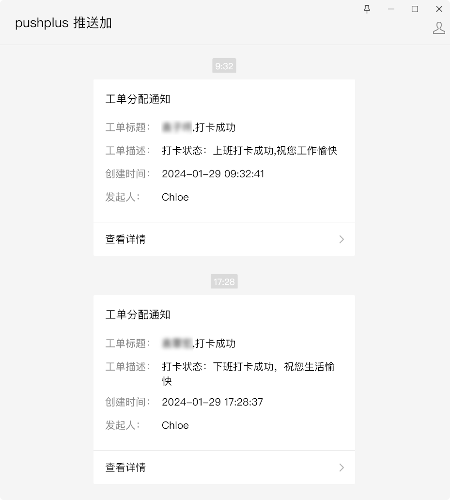

本人已毕业，无账户可继续支持新功能开发。

## 项目描述

本项目旨在帮助黔职通用户实现自动打卡，并提供打卡状态推送功能。



## TODO

- [X] 获取 Token、ID
- [X] 获取 打卡地址
- [X] 支持 MYSQL
- [X] 上下班打卡
- [ ] 月报、周报功能
- [ ] 补卡
- [X] 多用户功能
- [ ] PostgreSQL/SQLite
- [ ] WEB UI 界面
- [ ] 企业微信、钉钉、Telegram、QQ等消息平台
- [ ] 随机打卡时间

## 依赖安装

版本推荐：
- Python >= 3.12.1
- pip >= 23.2.1

### Linux 使用虚拟环境(推荐)
```
python3 -m venv /opt/qzt/qzt_venv
source qzt_venv/bin/activate
pip install -r requirements.txt
apt install -y make gcc
```

如果遇到以下报错：`ImportError: libGL.so.1: cannot open shared object file: No such file or directory`，可以尝试以下解决方法：
```
apt install -y libgl1-mesa-glx
```

## 使用

1、在 `main.py` 中设置数据库地址。

2、数据库执行`user_info.sql`和`user.sql`文件

3、运行 `main.py` 登录黔职通并获取用户信息。

```
python3 main.py {phonenumber} {password}
```

4、数据库`user_info`表需要手动写入 `address`、`address_lite (随便填也行，效果为push推送时所展示地点)`

下面为示例，带中文注释的需要手动填写

经纬度获取工具：https://api.map.baidu.com/lbsapi/getpoint/index.html

```
{
  "typeId": 10,
  "latitude": 30.654524, // 纬度
  "latitude2": "30.654524", // 纬度（第二组）
  "listPhoto": [],
  "longitud2": "104.089777", // 经度（第二组）
  "longitude": 104.089777, // 经度
  "cardRemark": "YSX", // 姓名
  "checkRange": 2000, // 签到范围
  "enterpriseId": "987ef96032b44752a910e53f988ac749", // 企业唯一标识符
  "locationCode": "",
  "locationName": "四川省成都市成华区成都太古里河畔亚朵酒店" // 地点名称
}
```

执行SQL
```UPDATE user_info
INSERT INTO user_info (typeId, latitude, latitude2, listPhoto, longitud2, longitude, cardRemark, checkRange, enterpriseId, locationCode, locationName) 
VALUES (10, 30.654524, '30.654524', '[]', '104.089777', 104.089777, 'YSX', 2000, '987ef96032b44752a910e53f988ac749', '', '四川省成都市成华区成都太古里河畔亚朵酒店');

UPDATE user_info
SET address_lite = '四川省成都市成华区成都太古里河畔亚朵酒店'
WHERE userid = 391978;
```

5、运行 `punchClock.py` 实现上下班打卡和打卡状态推送。

```python3 punchClock.py {userId}
python3 punchClock.py {userId}
```

## 注意

- 本项目仅供学习交流使用，请勿用于非法用途。
- 本项目不保证打卡成功，请自行承担使用风险。

## 贡献

欢迎对本项目进行贡献。请在提交代码前仔细阅读贡献指南。
